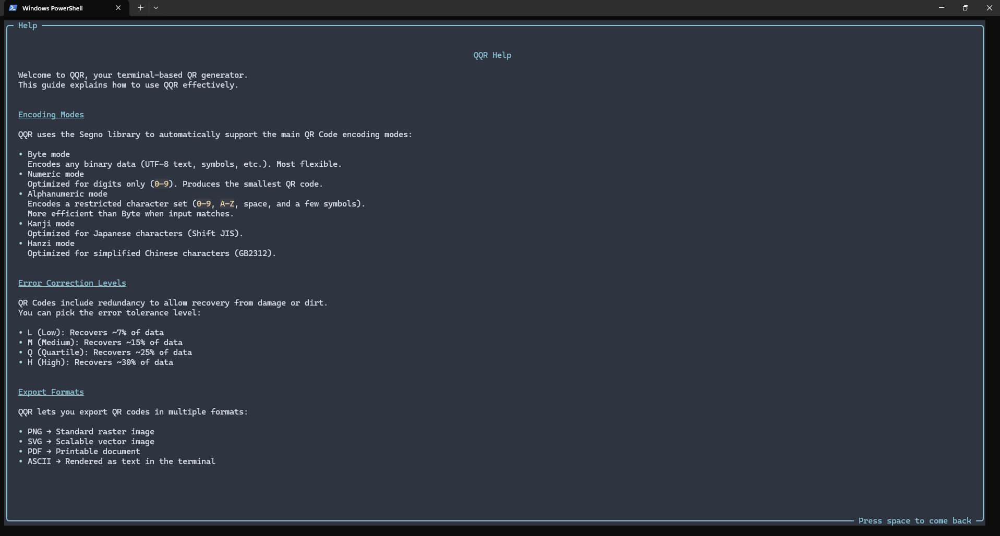
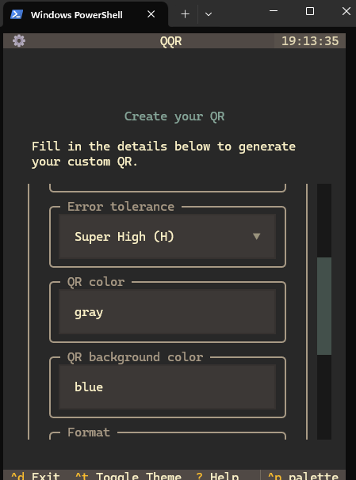

# [QQR](https://github.com/0spol/qqr) · [](https://github.com/0spol/qqr/blob/main/LICENSE)

**QQR** is a terminal-based QR code generator that supports CLI and TUI.

---
## Screenshots





---
## Features

* Terminal-based QR code generation
* Multiple encoding modes: Byte, Numeric, Alphanumeric, Kanji, Hanzi
* Adjustable error correction levels: L, M, Q, H
* Export options: PNG, SVG, PDF, ASCII
* Lightweight and easy to use

---
## Setup

1. Clone the repository:

   ```bash
   git clone https://github.com/0spol/qqr.git
   ```

---
## Contributing

Read our [Contributing Guide](./CONTRIBUTING.md) to learn about:

---
## Code of Conduct
This repository has adopted a Code of Conduct for all participants.
Please read the [full text](./CODE_OF_CONDUCT.md) to understand what actions will and will not be tolerated.

---
## License

This project is licensed under the [Apache 2.0 License](./LICENSE.md).
