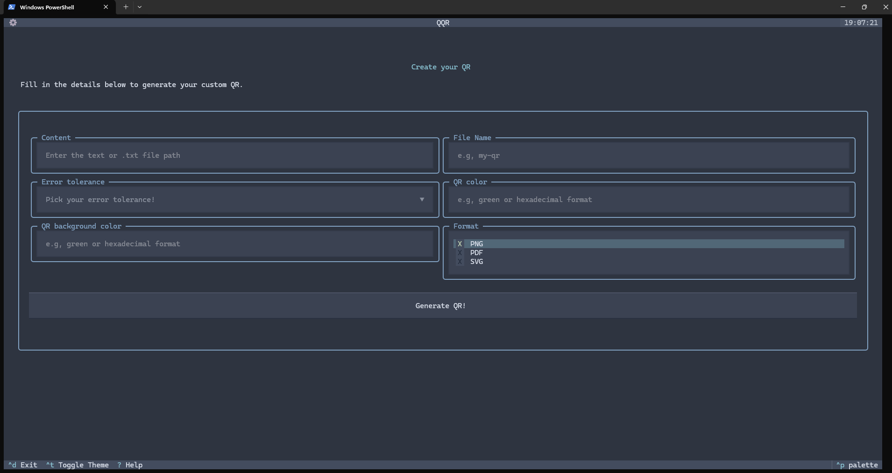

# [QQR](https://github.com/0spol/qqr) · [](https://github.com/0spol/qqr/blob/main/LICENSE)

**QQR** is a terminal-based QR code generator that supports CLI and TUI.

---
## Screenshots




---
## Features

* Terminal-based QR code generation
* Multiple encoding modes: Byte, Numeric, Alphanumeric, Kanji, Hanzi
* Adjustable error correction levels: L, M, Q, H
* Export options: PNG, SVG, PDF, ASCII
* Lightweight and easy to use

---
## Setup

Here’s a **cleaned-up and improved version** of your setup guide. I’ve added clarity, consistent formatting, and explicit instructions for both CLI and TUI usage:

---

## Setup

1. **Clone the repository**:

```powershell
git clone https://github.com/0spol/qqr.git
cd qqr
```

2. **Create and activate a virtual environment**:

```powershell
python -m venv .venv
.venv\Scripts\Activate.ps1      # Windows PowerShell
# Or for Command Prompt:
# .venv\Scripts\activate.bat
# Or for Linux/macOS:
# source .venv/bin/activate
```

3. **Upgrade pip**:

```powershell
python -m pip install --upgrade pip
```

4. **Install the project**:

```powershell
pip install .
```

* This will install all required dependencies and make the `qqr` and `tui` commands available.

5. **Run the application**:

* **CLI mode**:

```powershell
qqr --help
```

* **TUI mode**:

```powershell
tui
```

## Contributing
Read our [Contributing Guide](./CONTRIBUTING.md) to learn about:

## Code of Conduct
This repository has adopted a Code of Conduct for all participants.
Please read the [full text](./CODE_OF_CONDUCT.md) to understand what actions will and will not be tolerated.

---
## License

This project is licensed under the [Apache 2.0 License](./LICENSE.md).
